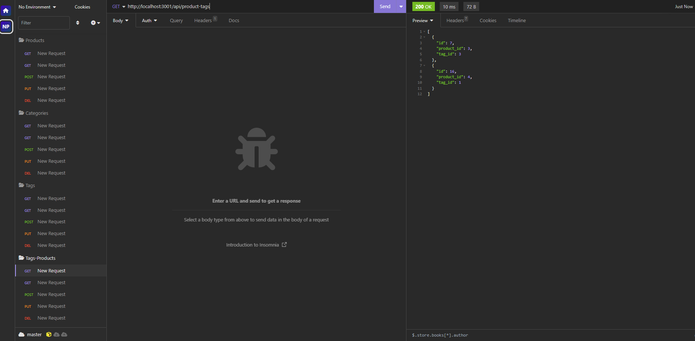

# EcommElite

](https://opensource.org/licenses/MIT)

## Description

EcommElite is a backend application for managing an e-commerce platform. It uses Sequelize to interact with a MySQL database, allowing users to perform CRUD (Create, Read, Update, Delete) operations on products, categories, and tags.

## Table of Contents
- [Installation](#installation)
- [Technologies Used](#technologiesused)
- [Usage](#usage)
- [API Endpoints](#apiendpoints)
- [License](#license)
- [Contributing](#contributing)
- [Questions](#questions)
- [Contact](#contact)

## Installation

1. Clone this repository.
2. Run npm install to install all dependencies.
3. Ensure you have MySQL installed and running.
4. Set up your .env file with your MySQL credentials.
5. Run npm run seed to initialize the database.
6. Start the application with npm start.

## Technologies Used

-Node.js
-Express.js
-Sequelize
-MySQL

## Usage

This application does not have a frontend. To interact with it, tools like Postman or Insomnia are recommended.

## API Endpoints

Categories

GET /api/categories - Retrieve all categories.

GET /api/categories/:id - Retrieve a category by ID.
POST /api/categories - Create a new category.
PUT /api/categories/:id - Update a category by ID.
DELETE /api/categories/:id - Delete a category by ID.

Products

GET /api/products - Retrieve all products.

GET /api/products/:id - Retrieve a product by ID.

POST /api/products - Create a new product.

PUT /api/products/:id - Update a product by ID.

DELETE /api/products/:id - Delete a product by ID.

Tags
GET /api/tags - Retrieve all tags.
GET /api/tags/:id - Retrieve a tag by ID.
POST /api/tags - Create a new tag.
PUT /api/tags/:id - Update a tag by ID.
DELETE /api/tags/:id - Delete a tag by ID.

Product-Tags Relations
GET /api/product-tags - Retrieve all product-tag relations.
GET /api/product-tags/:id - Retrieve a product-tag relation by ID.
POST /api/product-tags - Create a new product-tag relation.
PUT /api/product-tags/:id - Update a product-tag relation by ID.
DELETE /api/product-tags/:id - Delete a product-tag relation by ID.

## License

This project is licensed under the MIT License.

## Contributing

We welcome contributions. Please feel free to submit a pull request or open an issue on GitHub.

## Contact

- GitHub: [https://github.com/your-username/your-repo](https://github.com/Nagaft/Note-Web)
- Email: nagaf999@gmail.com
